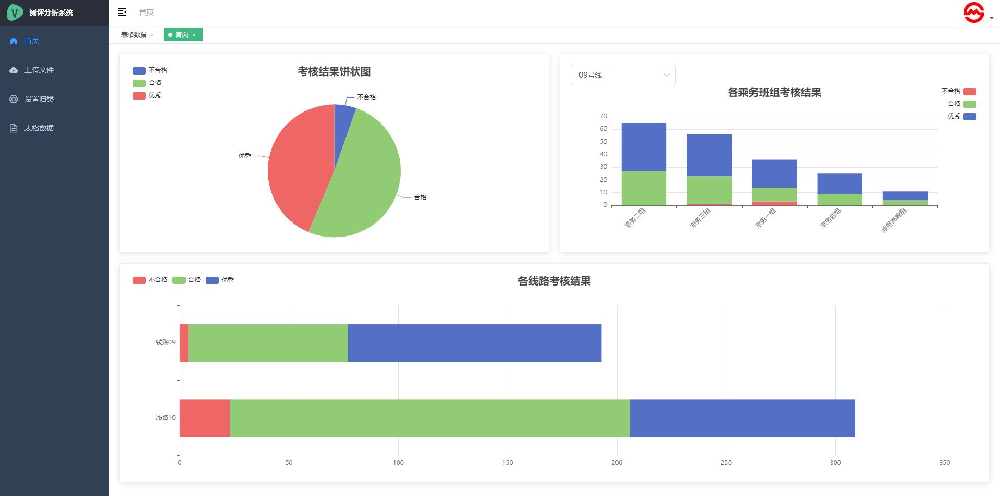
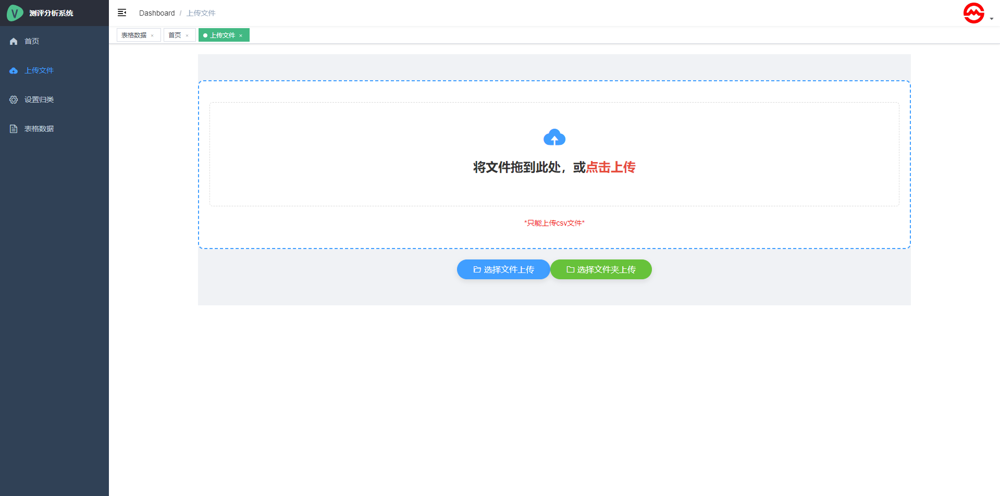
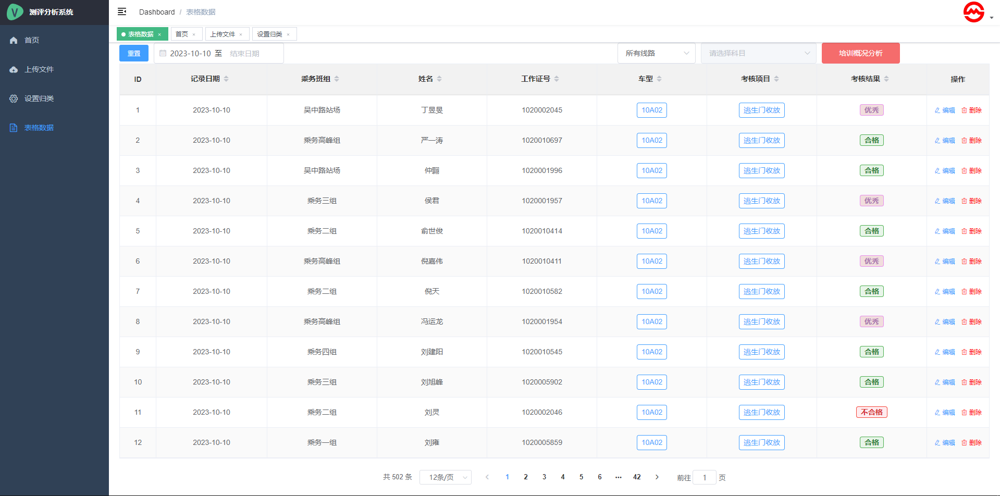

# vue-admin-template

> 这是一个极简的 vue admin 管理后台。它只包含了 Element UI & axios & iconfont & permission control & lint，这些搭建后台必要的东西。

## Build Setup

### 1. 安装所需要的依赖
```bash
npm install
```
### 2. 启动前端的服务器
```bash
npm run server
```

### 浏览器访问 [http://localhost:8080](http://localhost:8080)




## 发布

```bash
# 构建测试环境
npm run build:stage

# 构建生产环境
npm run build:prod
```